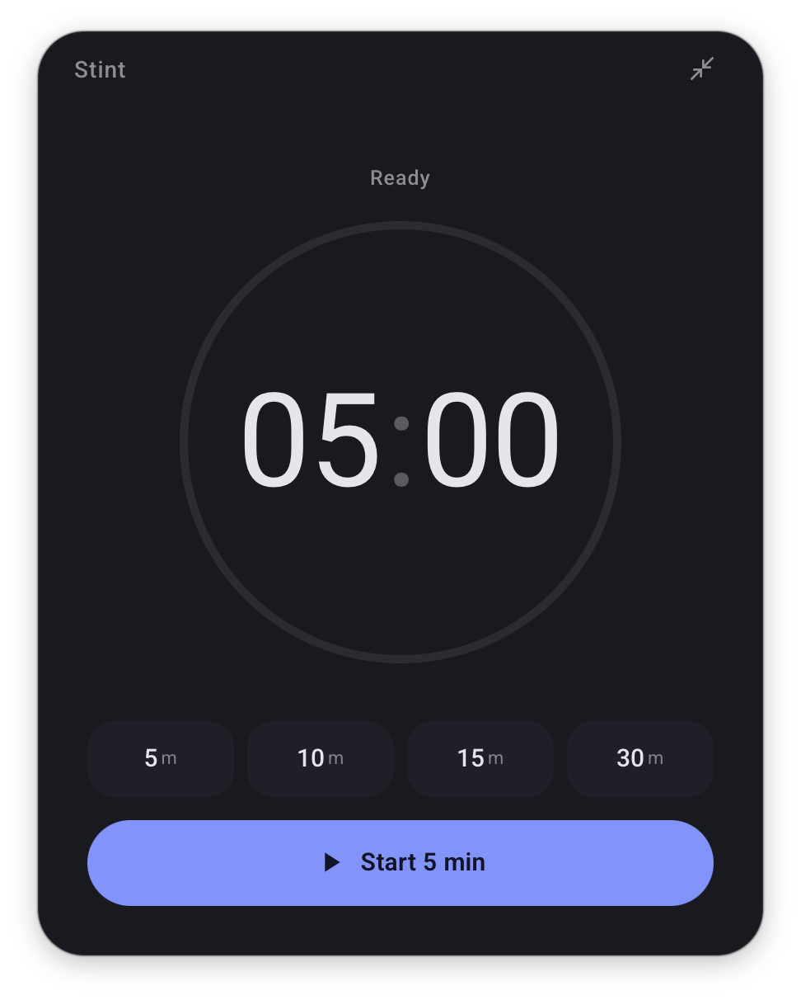
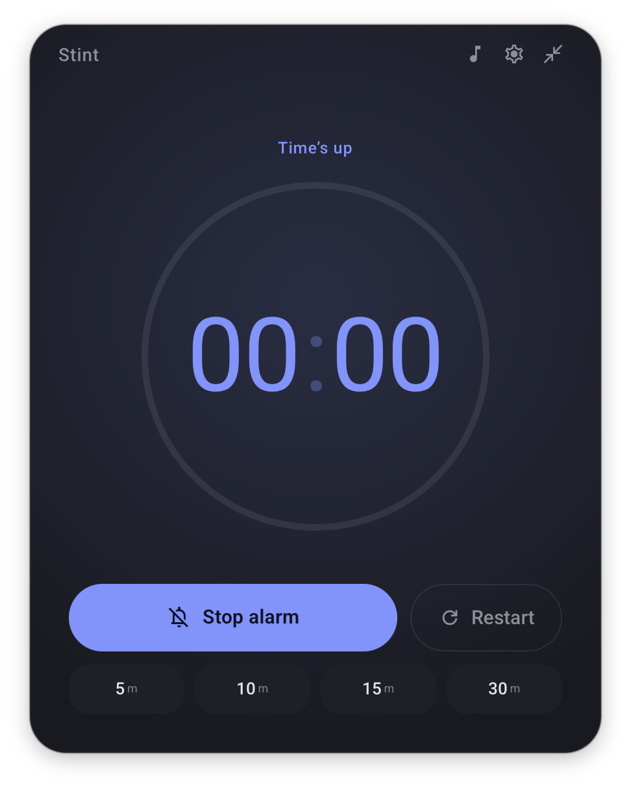

<h1 align="center">Stint</h1>

<h3 align="center">A calm, single-purpose focus timer for your desktop. One click to start, a quiet countdown while you work, a gentle chime when time's up. Not a Pomodoro suite, not a task manager — just a timer that respects your attention.</h3>

<p align="center">
  <a href="https://github.com/PierrickMartos/stint/releases/latest"></a>
  <a href="https://github.com/PierrickMartos/stint/actions/workflows/release.yml"></a>
</p>

<p align="center">
  
  
  
</p>

## Features

|  |  |
|---|---|
| **One-click start** | Presets for 5 / 10 / 15 / 30 minutes start the countdown immediately. Click the big numerals to type any custom duration (`12:30`, `7`, `12.5`). |
| **Focus music** | A bundled lo-fi track ("Morning Coffee" by [HoliznaCC0](https://freemusicarchive.org/music/holiznacc0/lo-fi-and-chill), CC0 / public domain) loops softly while you focus. On by default — adjust the volume in the ⚙ settings panel, or mute it with one click from either layout's ♪ button. |
| **Bring your own music** | Paste a direct audio URL or a Spotify song/playlist link in the ⚙ settings panel. Audio URLs stream in-app; Spotify links drive the local Spotify desktop app (macOS) — the timer starts, pauses, and stops your playlist for you. If anything's unreachable, the bundled track takes over — never silence. |
| **Your default stint** | Pin a preset in settings and `Space` always starts it — or leave it on "Last used". |
| **The countdown is the hero** | A large tabular display with a depleting progress ring. Distinct, calm states for ready / focusing / paused / time's up. |
| **Gentle alarm + native notification** | A soft two-note chime repeats until dismissed, paired with a macOS notification — you won't miss the end, and it won't startle you. |
| **Compact mode** | Collapse the window to a slim 376×116 glanceable bar that floats anywhere on your desktop, with the essentials one click away. |
| **Accurate & relaunch-safe** | The engine counts down to an absolute end timestamp — never a decrementing counter — so it stays exact through sleep, hidden windows, and even an app restart mid-timer. |
| **Keyboard-first** | `Space` to start / pause / resume, `Esc` to cancel. That's the whole manual. |
| **Tiny footprint** | A native Tauri app using the system WebView: the whole thing is ~11 MB — and ~3 MB of that is the music. |
| **Cross-platform** | macOS (universal), Windows, and Linux builds from one codebase, published on every release. |

## Install

Every release ships native bundles for all three platforms — grab yours from [the latest release](https://github.com/PierrickMartos/stint/releases/latest).

### macOS — one-liner (recommended)

Installs the latest release into `/Applications` — run the same command again any time to update:

```bash
curl -fsSL https://raw.githubusercontent.com/PierrickMartos/stint/main/scripts/install.sh | bash
```

Because the script downloads via `curl`, the app arrives without Gatekeeper's quarantine flag and opens straight away. If you download the `.dmg` with a browser instead, the app is not notarized (no Apple Developer account), so clear the flag on first launch:

```bash
xattr -dr com.apple.quarantine /Applications/Stint.app
```

### Windows

Download the `.msi` (or NSIS `.exe`) installer from [the latest release](https://github.com/PierrickMartos/stint/releases/latest) and run it. The binary is unsigned, so SmartScreen will ask once — **More info → Run anyway**.

### Linux

Pick your format from [the latest release](https://github.com/PierrickMartos/stint/releases/latest):

```bash
# AppImage — portable, any distro
chmod +x Stint_*.AppImage && ./Stint_*.AppImage

# Debian / Ubuntu
sudo dpkg -i Stint_*.deb

# Fedora / RHEL
sudo rpm -i Stint-*.rpm
```

> The frameless rounded window needs a compositor (default on GNOME/KDE); without one it falls back to square corners.

### Or build from source

```bash
# 1. One-time: Rust + Node (+ Linux system deps — see https://tauri.app/start/prerequisites/)
curl --proto '=https' --tlsv1.2 -sSf https://sh.rustup.rs | sh

# 2. Clone and build
git clone https://github.com/PierrickMartos/stint.git
cd stint
npm install
npm run tauri build

# 3. Bundles land in src-tauri/target/release/bundle/
```

## Keyboard shortcuts

| Key | Action |
|---|---|
| `Space` | Start · pause · resume — and stop the alarm when time's up |
| `Esc` | Cancel the running timer / dismiss the alarm |
| Click the time | Set a custom duration (idle only) — `Enter` confirms, `Esc` aborts |

## How it works

1. **Timestamp engine** — starting a timer stores an absolute end time; every frame derives `remaining = endTime − now`. Pausing freezes the remainder; resuming recomputes the end time. A `setTimeout` fallback guarantees completion fires even when rendering is throttled in a hidden window.
2. **Relaunch-safe** — lifecycle changes persist to local storage. Quit mid-countdown and reopen: the timer is still running, on time. A timer that expired while the app was closed resets quietly instead of blaring the alarm at launch.
3. **Isolated side-effects** — all completion behavior (WebAudio chime loop, native notification via Tauri's notification plugin) lives behind a single `AlarmAdapter`, all music playback behind a `MusicAdapter` (the engine starts/pauses/stops it but never touches the `<audio>` element), and all window-shell concerns (native resize for compact mode, drag regions) behind `shell.ts`.
4. **The window is the app** — a frameless, transparent native window renders the floating panel directly; the compact toggle resizes the real window between 440×560 and 376×116.

## Releases

Tag a version matching `src-tauri/tauri.conf.json` and push — GitHub Actions builds native bundles on macOS (universal), Windows, and Linux runners and publishes them all to one GitHub Release:

```bash
git tag v0.1.0 && git push origin v0.1.0
```

## Layout

- `src/engine.ts` — timestamp-based countdown state machine + persistence
- `src/alarm.ts` — chime + native notification behind one adapter
- `src/music.ts` — focus-music playback behind one adapter (bundled track, custom audio URL, or local Spotify control; volume, mute, autoplay-retry, fallback)
- `src/settings.ts` — typed load/save of user preferences (music, volume, music source, default preset)
- `src/shell.ts` — Tauri window integration (resize, drag, environment detection)
- `src/main.ts` — DOM wiring, settings panel, and the single render function
- `src/assets/focus-music.m4a` — "Morning Coffee" by HoliznaCC0 (CC0 1.0), re-encoded to 128 kbps AAC
- `src-tauri/` — Rust shell, window config, icons (`icon-source.svg` is the mark's source of truth)
- `Timer.html` — the original verified single-file implementation the app derives from

## Design

The interface implements **Direction B — "Soft premium"** from a [Claude Design](https://claude.ai/design) exploration: soft indigo on a deep near-black surface, a depleting ring as the core motif, Material 3 token logic re-seeded away from stock Google styling. The app icon is the "Concentric" mark from the same exploration — two nested countdown arcs, quiet and instrument-like.
